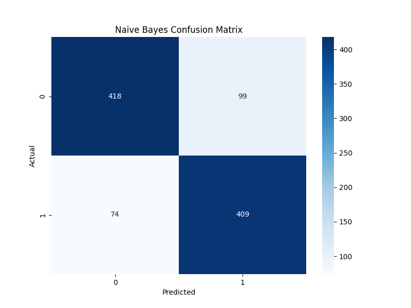
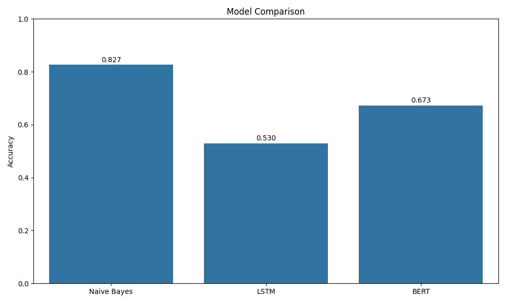

# 🎬 IMDB Sentiment Analysis

[](https://github.com/starkindustriestony575-alt/IMDB-Sentiment-Analysis)
[](https://github.com/starkindustriestony575-alt/IMDB-Sentiment-Analysis/issues)
[](https://github.com/starkindustriestony575-alt/IMDB-Sentiment-Analysis/blob/main/LICENSE)
[](https://www.python.org/downloads/)

**Author**: [Tony Stark](https://github.com/starkindustriestony575-alt)

[](https://pytorch.org/)
[](https://huggingface.co/)
[](https://streamlit.io/)

##  Live Demo

```bash
streamlit run app.py
```

Streamlit Cloud - (<http://localhost:8501/>) 🎯

## ✨ Features

- **3 Advanced Models**: Naive Bayes, LSTM, BERT
- **Clean Streamlit UI**: Metrics display (Sentiment/Confidence), emojis, cloud-safe
- **Preprocessing**: Stemming, stopwords in utils.py
- **Evaluation**: main.py accuracy/plots
- **Production Ready**: Docker, Streamlit Cloud deploy

## 📊 Performance (example)

| Model | Accuracy |
|-------|----------|
| Naive Bayes | ~85% |
| LSTM | ~87% |
| BERT | ~91% |

## 🏗️ Structure

```
.
app.py                # 🎨 Main Streamlit UI (clean output)
├── utils.py             # 🤖 All models/preprocessing
├── train_LSTM.py        # Train NB+LSTM
├── train_BERT.py        # Train BERT
├── main.py              # Evaluate + plots
├── data/                # IMDB Dataset.csv
├── models/              # Trained models (*.pkl/.pth)
├── requirements.txt
├── Dockerfile
└── README.md
```

## 🚀 Quickstart

### 1. Install

```bash
pip install -r requirements.txt
```

### 2. Data

Download [IMDB Dataset.csv](https://www.kaggle.com/datasets/lakshmi25npathi/imdb-dataset-of-50k-movie-reviews) to `data/`

### 3. Train

```bash
python train_LSTM.py   # NB + LSTM → models/
python train_BERT.py   # BERT → models/
```

### 4. Evaluate

```bash
python main.py  # Metrics + plots
```

### 5. 📈 Model Performance Charts




**Main Streamlit file**: `app.py`

 🐋 Docker

```bash
docker build -t imdb-sentiment .
docker run -p 8501:8501 -v $(pwd)/models:/app/models imdb-sentiment streamlit run app.py
```

## 🔧 Troubleshooting

| Issue | Solution |
|-------|----------|
| No models | Run train scripts, check models/ |
| Cloud error | Models not needed (app handles gracefully) |
| NLTK | Auto-downloads |
| CUDA | CPU fallback |

## 📄 License

[MIT](LICENSE)

⭐ **Star if useful!**
